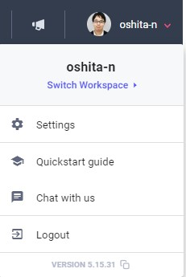
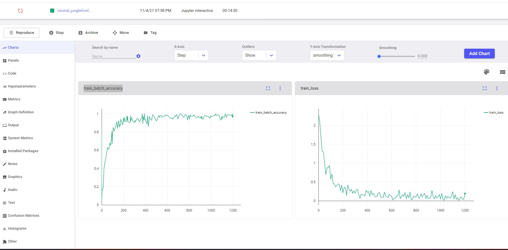

# Comet.mlとは
実験管理ツールです。クラウドに実験結果を保存しておけます。イメージとしてはtensorboardがオンラインにあるような感じです。  

# まずはcometに登録する
GitHubアカウントで簡単に登録できます。  
https://www.comet.ml  

そして、アカウントの画像にあるメニューから「Quickstart guide」をクリックすると、認証するためのソースコードが表示できます。  

あとはcometにある[サンプルコード](https://www.comet.ml/docs/python-sdk/pytorch/)を実行して、以下のようなURLをクリックすると別タブでサイトが開かれてログをリアルタイムで観察できます。   

`https://www.comet.ml/oshita-n/general/aaaaaaaaaaaaaaaaaa`

